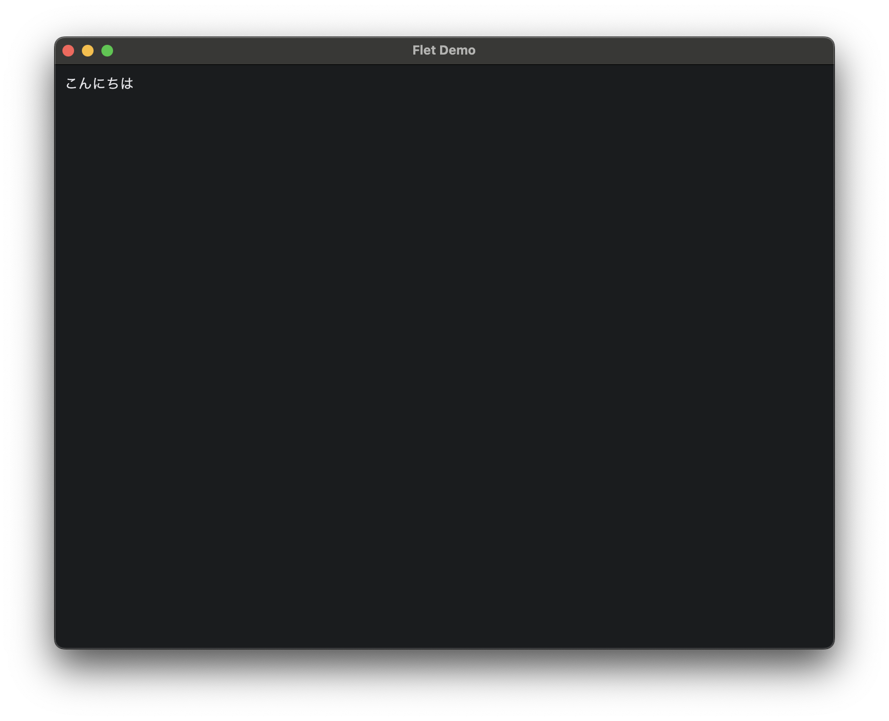

## PythonでのGUI
PythonでGUIを作る時、ライブラリの選択肢がまぁまぁあります。  
今回はfletを使用しますが、tkinterやPyQTとか。  
様々あるんですけどね、使っていて一番楽だったのがこのfletだったのでこれを布教しようっていう記事です。  

## Fletのインストール
```
pip install flet
```
です。  
まぁ簡単ですね。

## 基本の書き方
### ウィンドウを作ろう
```python
import flet as ft


def main(page: ft.Page):
    page.title = "Flet Demo"

    text = ft.Text("こんにちは")

    page.add(
        text
    )


ft.app(main)
```
これを実行すると  


こんな感じの見た目のウィンドウが作成できます。  
